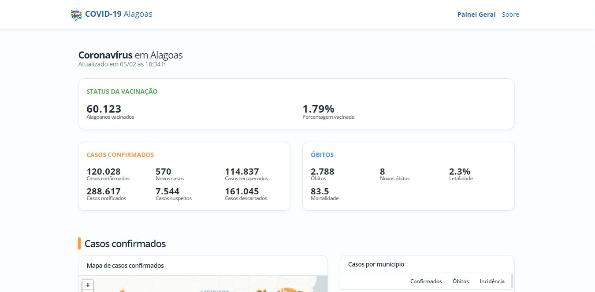

# Painel COVID-19 Alagoas

Este é um painel para monitoramento da evolução da COVID-19 em Alagoas desenvolvido em Vue. Nele, constam o acompanhamento da vacinação, casos e óbitos (e demais informações relacionadas) de todos os 102 municípios e ocupação de leitos.



Por utilizar uma API própria, atualmente encontra-se **desativado** devido a constante mudança no formato de divulgação das informações por parte da SESAU/AL, inviabilizando assim a manutenção da aplicação.

## Instalação
```
npm install
```

## Execução
```
npm run serve
```