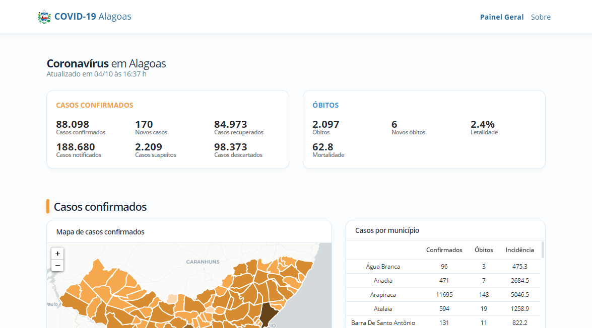

#  Painel COVID-19 Alagoas
Este dashboard foi desenvolvido com o propósito de centralizar as informações sobre a situação epidemiológica da COVID-19 no estado de Alagoas.

É importante ressaltar que este painel, apesar de reunir os dados emitidos pelos órgãos oficiais, não possui quaisquer vínculos com as Secretarias Municipais de Saúde, a Secretaria Estadual de Saúde de Alagoas ou com o Ministério da Saúde.
  
O painel possui as seguintes funcionalidades: 

- Mapa estadual de casos confirmados e óbitos.
- Gráficos diários de casos confirmados e óbitos, com as respectivas médias móveis.
- Tabela com os números de casos confirmados, óbitos, incidência, mortalidade e letalidade por município.
- Representação das comorbidades e dos óbitos por faixa etária.
- Listagem do número de leitos ocupados e reservados para COVID-19.

##  Instalação

O dashboard foi desenvolvido em **Vue.js**, para executá-lo, basta clonar o repositório, possuir o **Node.js** instalado em seu ambiente e rodar:

`npm install`

Após a instalação, execute a aplicação com:

`npm run serve`

Feito isto, basta acessar o dashboard em seu navegador (comumente, em `localhost:8080`).